# ParkBark
----

#####Introduction
This is the android application developed in San Francisco State University CSC413 of Spring 2015 under Professor Mark Sosnick.
We have released the very first alpha version.

##### API used
This android application includes Google maps API and SF Parking API.

# Screenshots of App functionality

## Loading screen

## Map showing parked car location with time remaining
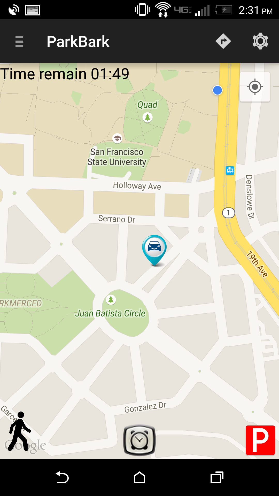

## Calculate time to walk using Haversines method - image 2
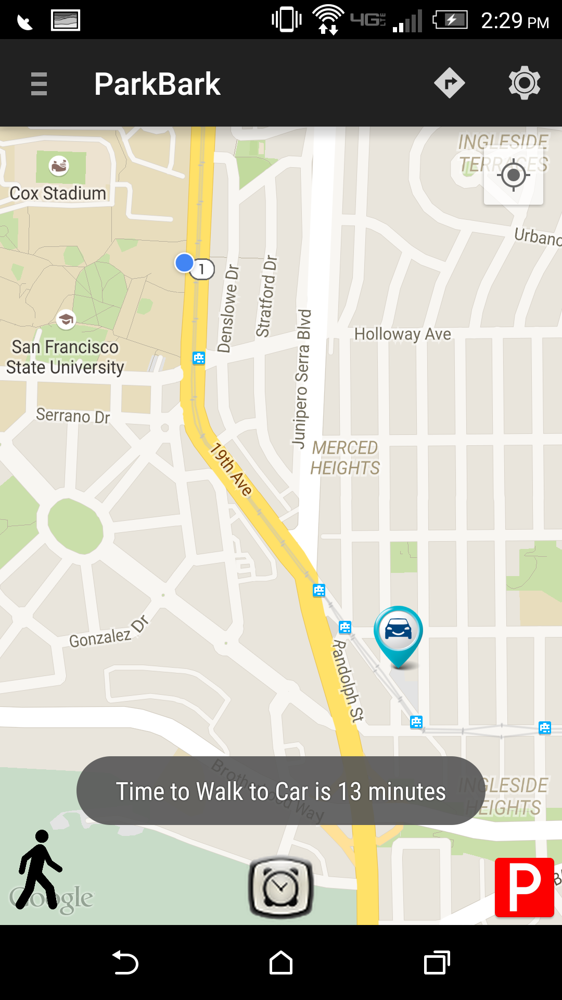

##  Time to walk to car with time remaining active. Red pins show previous parked locations.
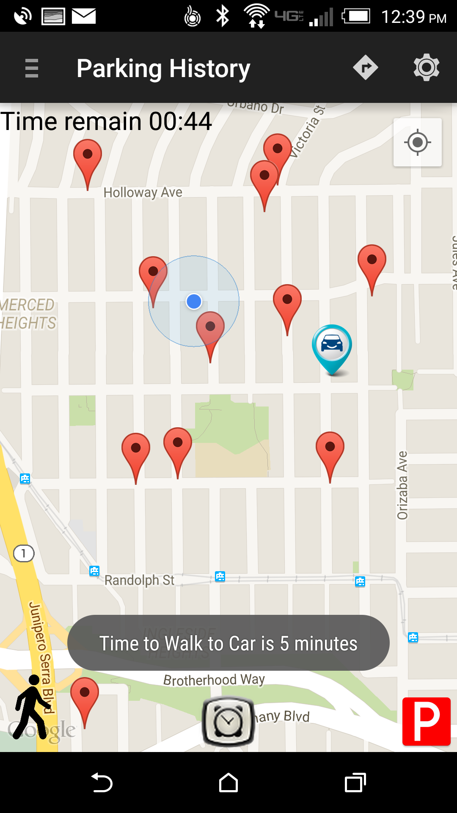

## Calculate time to walk using Haversines method.
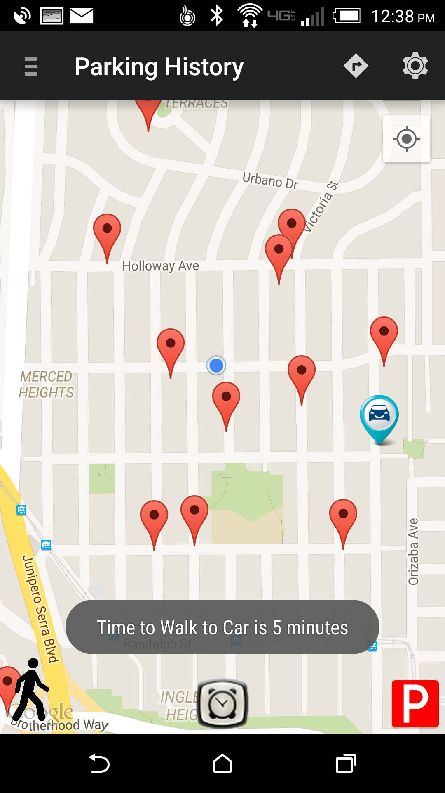

## Large circle around user indicates low gps accuracy
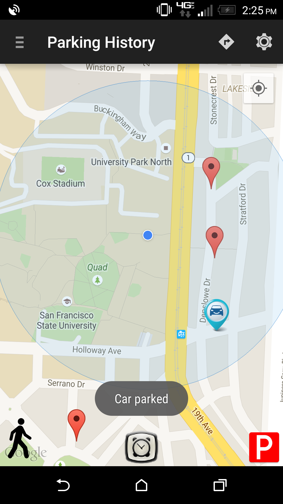

## Set parking alarm
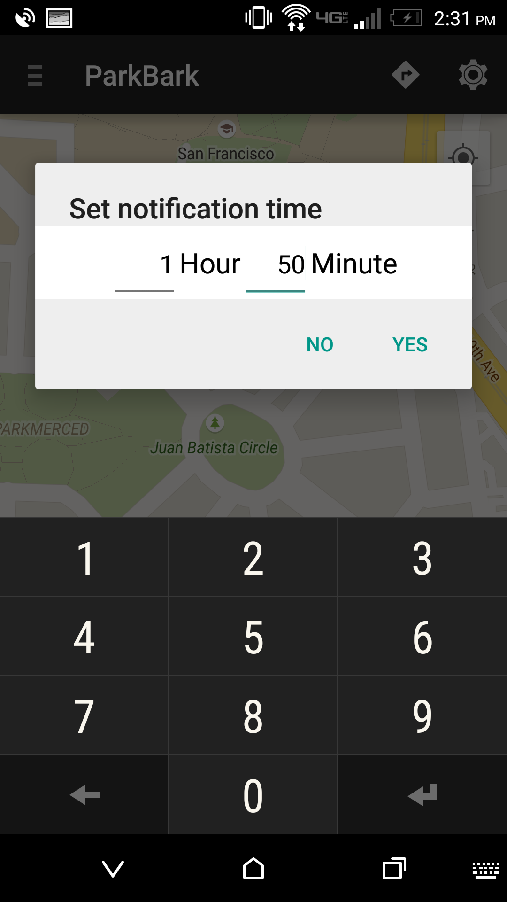

## Menu Screen with notification preferences 
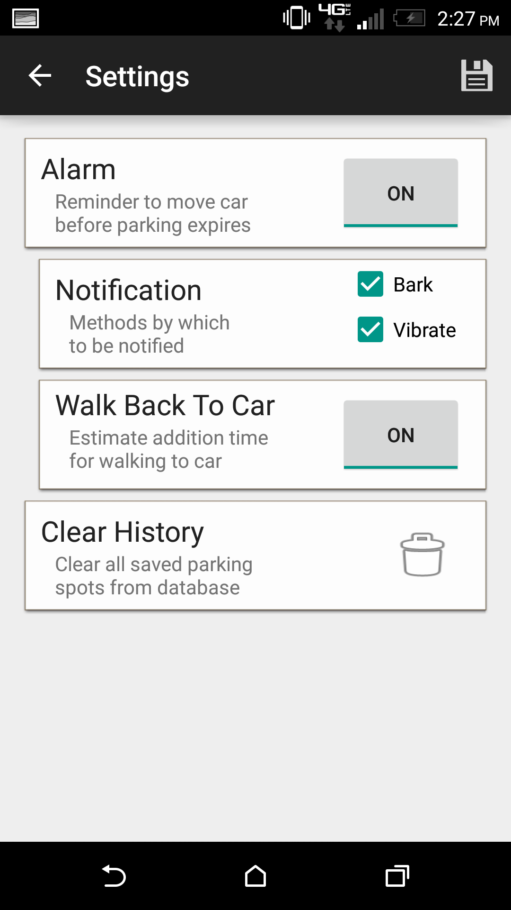

## Notification - move car
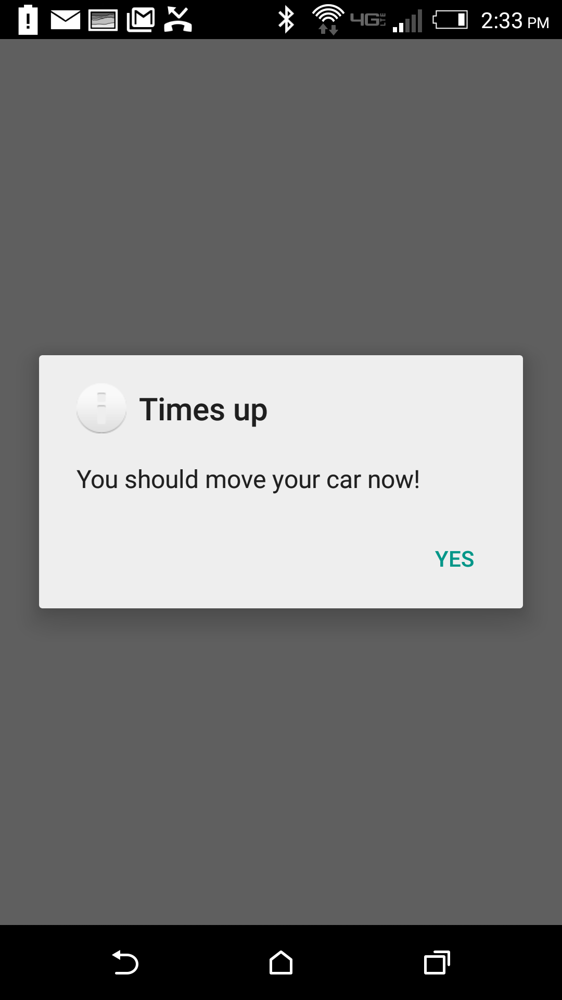

## Delete parking history confirmation screen
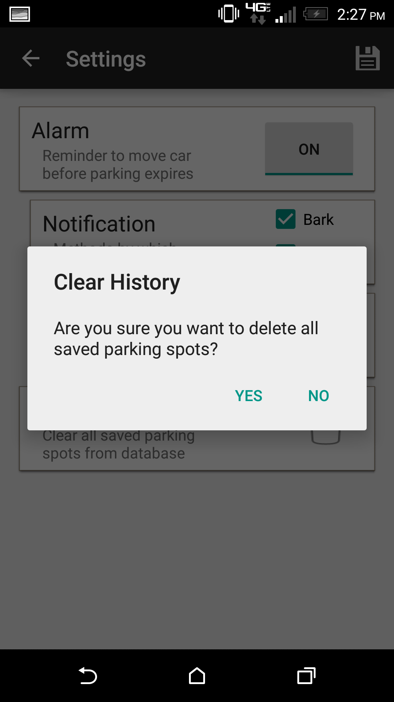

## SF Park available garage parking
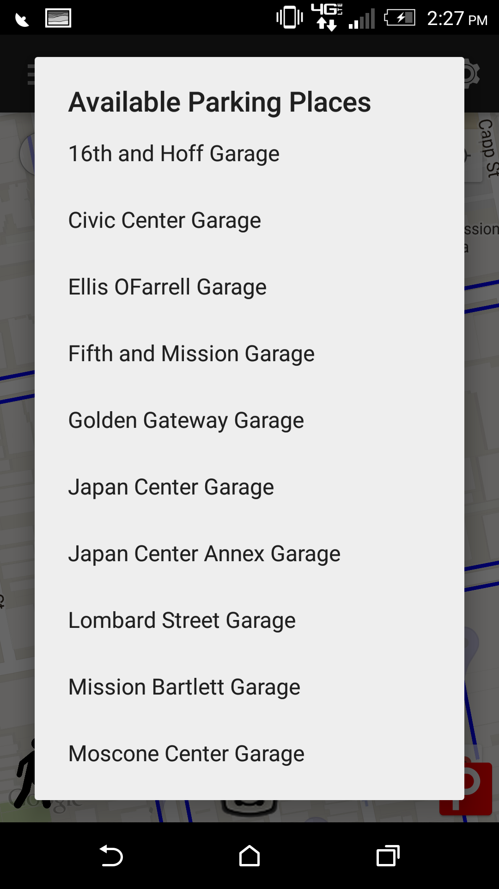

## SF Park Information overlay of garage and street parking availability
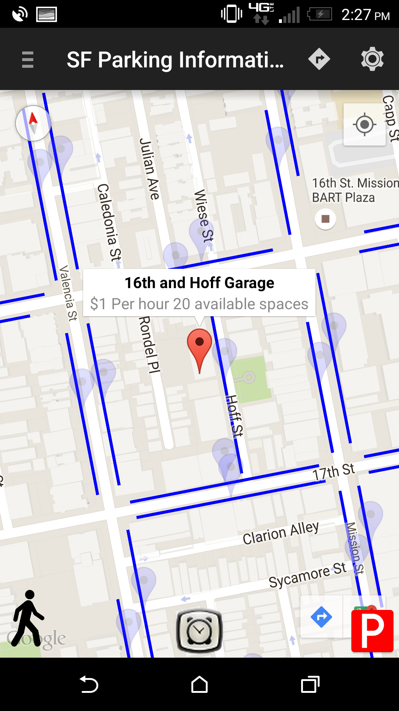

## Google maps navigation
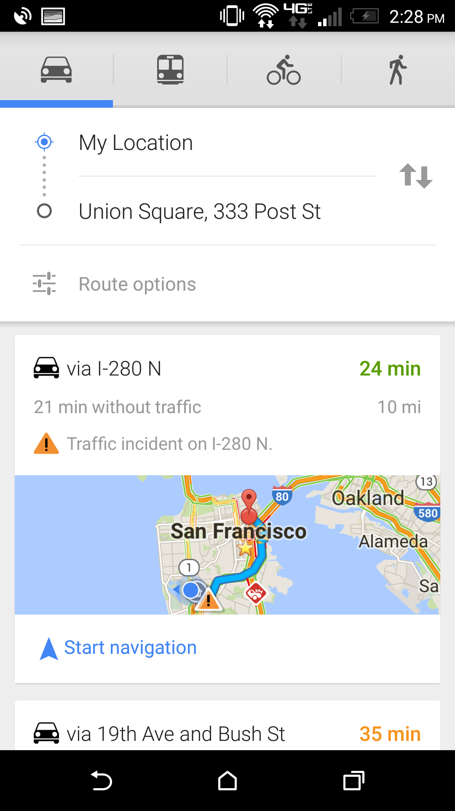

